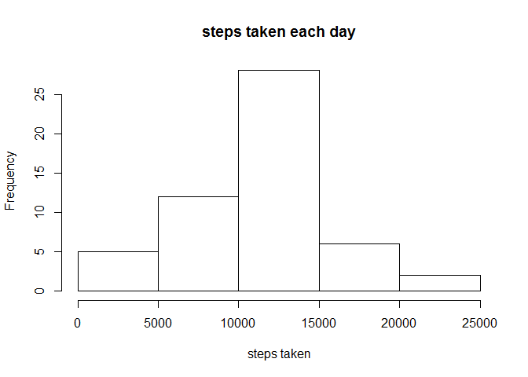

# Reproducible Research: Peer Assessment 1


## Loading and preprocessing the data

```r
sData <- read.csv("activity.csv")
midFrame <- data.frame(sData$date, sData$steps)


intervalMeans <- aggregate(.~sData$interval, data = sData, mean)
```


## What is mean total number of steps taken per day?

```r
daySums <- aggregate(.~sData$date, data = sData, sum)
hist(daySums$steps, main = "steps taken each day", xlab = "steps taken")
```



##Mean of steps per day:

```r
mean(daySums$steps)
```

```
## [1] 10766.19
```
##Median of steps per day:

```r
median(daySums$steps)
```

```
## [1] 10765
```


## What is the average daily activity pattern?

```r
plot(intervalMeans$steps, type = "l",main = "average daily activity pattern", xlab = "Intervals", ylab = "steps")
```


##Interval with average maximum number of steps:

```r
maxInterval <- intervalMeans$interval[intervalMeans$steps == max(intervalMeans$steps)]
maxInterval
```

```
## [1] 835
```


## Imputing missing values
## Total number of missing values:

```r
nas <- sData[!complete.cases(sData),]
sumNas <- nrow(nas)
sumNas
```

```
## [1] 2304
```

##Missing value replacement (replaced with overall mean for same interval):

```r
replaceVec <- tapply(sData$steps, sData$interval, mean, na.rm=TRUE, simplify=TRUE)
fData <- sData
misSteps <- is.na(sData$steps)
fData$steps[misSteps] <- replaceVec[as.character(fData$interval[misSteps])]

hist(daySums$steps, main = "steps taken each day (with replacement)", xlab = "steps taken")
```


```r
fdaySums <- aggregate(.~sData$date, data = fData, sum)
```

##Mean of steps per day (with replacement):

```r
mean(fdaySums$steps)
```

```
## [1] 10766.19
```
##Median of steps per day (with replacement):

```r
median(fdaySums$steps)
```

```
## [1] 10766.19
```


## Are there differences in activity patterns between weekdays and weekends?

```r
fData$weekday <- weekdays(as.Date(fData$date))
par(mfcol = c(2,1))
endset <- fData[fData$weekday == "Saturday" | fData$weekday == "Sunday",]
endset$weekday <- NULL
weekset <- fData[!(fData$weekday == "Saturday" | fData$weekday == "Sunday"),]
weekset$weekday <- NULL

weekendMeans <- aggregate(.~endset$interval, data = endset, mean)
weekdayMeans <- aggregate(.~weekset$interval, data = weekset, mean)
combinedMeans <- data.frame(weekdayMeans$interval, weekdayMeans$steps, weekendMeans$steps)

options(warn = -1)
library(latticeExtra)
```

```
## Loading required package: lattice
```

```
## Loading required package: RColorBrewer
```

```r
p1 <- xyplot(weekdayMeans.steps~weekdayMeans.interval, data = combinedMeans, panel = panel.lines, horizontal = FALSE)
p2 <-xyplot(weekendMeans.steps~weekdayMeans.interval, data = combinedMeans, panel = panel.lines)
c(p1, p2, layout = c(1,2))
```


